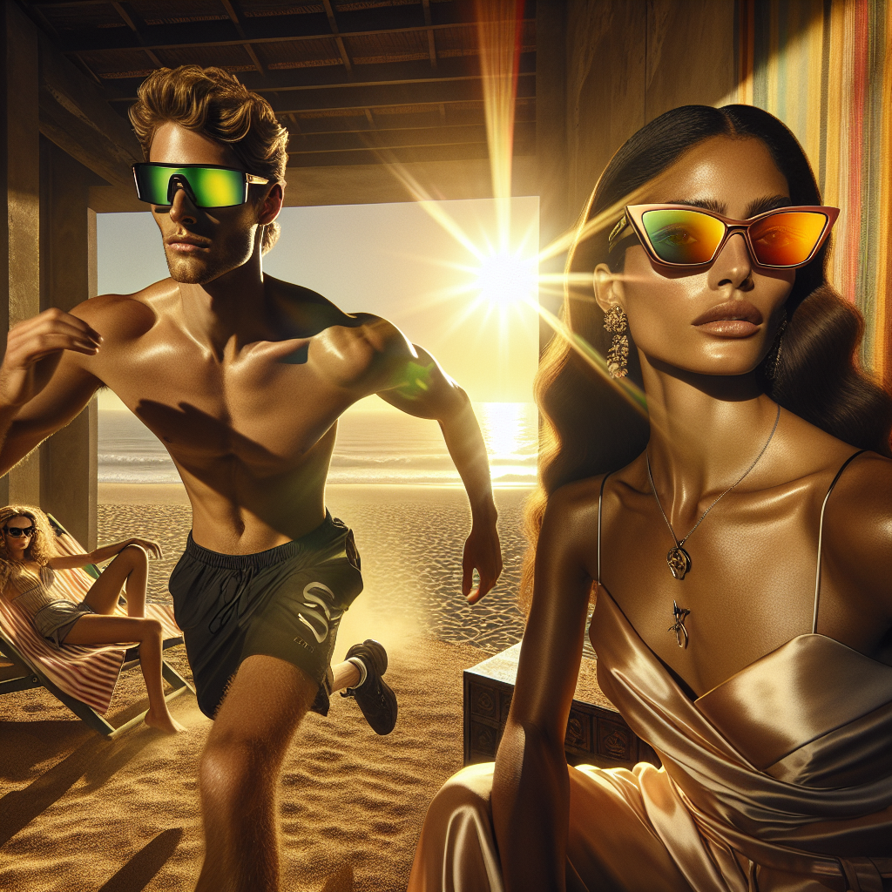

# 🕶️ Summer Sunglasses Campaign – Executive Summary

## 📊 Refined Trend Insights
Summer 2026 Sunglasses Trend Summary

As we prepare for a season defined by performance, glamour and nostalgia, we recommend spotlighting three distinct styles that align with consumer demand and reinforce our brand’s versatility.

1. Performance-Driven Wraparounds (SG004 “Sport”)  
   – Insight: One-piece shield lenses with sleek, continuous curves capture the modern athletic spirit.  
   – Why It Works: Ultra-light frames, flexible hinges and rubberized temple grips ensure both high-performance function and all-day comfort—ideal for adventure-seeking customers.

2. Elevated Cat-Eye Frames (SG003 “Mystique”)  
   – Insight: Sharp, angular corners and ornate temple detailing reinvent the classic cat-eye into a statement of contemporary femininity.  
   – Why It Works: Subtle upward sweeps at each brow line and polished accents mirror the latest runway looks, positioning “Mystique” as the go-to choice for fashion-savvy shoppers.

3. Retro-Chic Wayfarers (SG002 “Wayfarer”)  
   – Insight: Thick acetate frames and bold angles channel ’70s/’80s nostalgia with a Y2K twist—perfect for self-expressive styling.  
   – Why It Works: A confident silhouette that transitions effortlessly from beach to boulevard, catering to a broad audience drawn to vintage-inspired designs.

Recommendation  
Lead the Summer 2026 launch with SG004 “Sport” and SG003 “Mystique” as flagship “edgy” and “glam” offerings, then broaden your appeal by adding SG002 “Wayfarer.” This triad captures the season’s core themes—performance, elevated femininity and retro flair—ensuring comprehensive market coverage and maximum consumer engagement.

## 🎯 Campaign Visual

    

## ✍️ Campaign Quote
Golden Horizons: Sport Wraparound Meets Cat-Eye Couture

## ✅ Why This Works
This line captures the image’s sun-kissed beach glow and dynamic energy, while spotlighting the Summer 2026 trends—ultra-modern Sport shields and bold cat-eye silhouettes—into one elegant, evocative phrase.

---

*Report generated on 2026-02-19*
