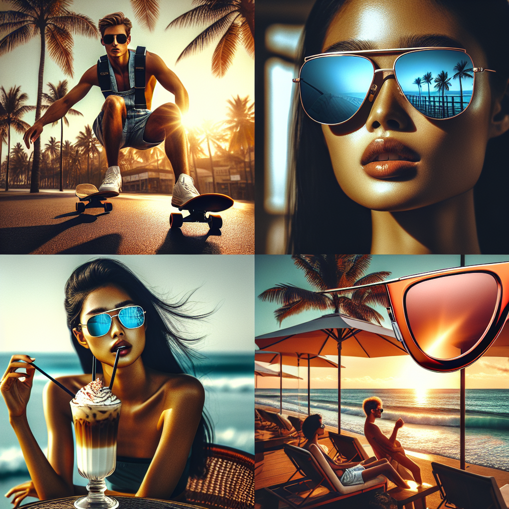

# 🕶️ Summer Sunglasses Campaign – Executive Summary

## 📊 Refined Trend Insights
Summer 2026 Sunglasses Trends: Executive Summary

Overview  
As consumers seek both performance and personality, three distinct eyewear movements will define summer 2026. By combining sport-inspired innovation, refined metallic accents, and bold retro silhouettes, we can capture diverse lifestyle moments and drive premium growth.

1. Futuristic Shield & Wraparound Designs  
   – Single-lens, curved frames that marry athletic functionality with a forward-looking aesthetic.  
   – Appeal: Full-coverage protection and dynamic styling for active, trend-driven consumers.

2. Polished Metal Minimalism  
   – Sleek aviator shapes and ultra-thin metal details delivering a modern, high-end finish.  
   – Appeal: Timeless elegance with superior UV performance—ideal for both casual and upscale occasions.

3. Statement Cat-Eye & Vintage Shapes  
   – Dramatic upswept corners and heritage-inspired curves for expressive, fashion-forward looks.  
   – Appeal: A powerful vehicle for self-expression, tapping into the resurgence of retro glamour.

Strategic Catalog Recommendations  
Our top three SKUs directly align with these trends, ensuring a balanced summer assortment and maximizing cross-segment appeal.

1. SG004 “Sport”  
   • Why It Works: Oversized, wraparound single-lens delivers the futuristic shield look with integrated rubber grips for active lifestyles.  
   • Positioning: A performance-driven hero SKU that reinforces our leadership in functional innovation.

2. SG001 “Aviator”  
   • Why It Works: Lightweight metal frame and classic teardrop silhouette meet the polished-metal trend, offering enduring style and reliable UV protection.  
   • Positioning: A versatile cornerstone style that bridges sport and sophistication, driving high sell-through across price tiers.

3. SG003 “Mystique”  
   • Why It Works: Feminine cat-eye profile with subtle upsweep captures the retro revival, delivering a premium, statement-making option.  
   • Positioning: A fashion-first offering that enhances our brand’s luxury credentials and caters to self-expressive shoppers.

By spotlighting these three distinct silhouettes—futuristic shields, refined metals, and bold retro shapes—we secure a comprehensive summer lineup that speaks to every key customer segment and strengthens our market leadership.

## 🎯 Campaign Visual

    

## ✍️ Campaign Quote
Summer Redefined: Futuristic Shields, Polished Metal, Retro Cat-Eyes

## ✅ Why This Works
This line highlights the three core Summer ’26 trends—oversized shield silhouettes, sleek metal aviator frames, and bold cat-eye styles—while echoing the image’s sunlit beach scenes, reflective lenses, and vintage-meets-futuristic vibe.

---

*Report generated on 2026-02-19*
